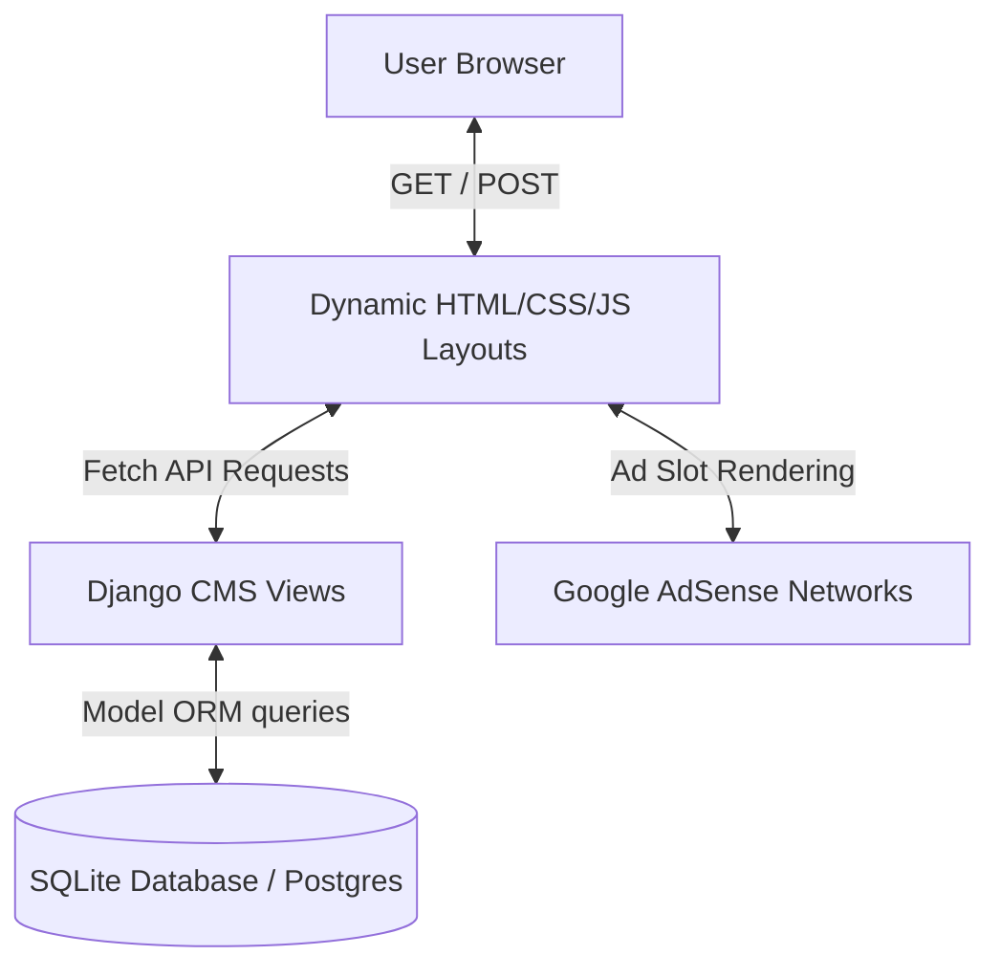

# Speedlink3 AI Technologies - Enterprise Cloud Portal

A premium, high-performance web platform built to showcase the services, projects, and articles of **Speedlink3 AI Technologies**. Rebuilt from a legacy WordPress setup into a modern, secure Django architecture with a glassmorphic dark-themed layout and interactive AI assistant widget.

---

## 1. Learning Guidelines & Setup

This portal serves as a practical blueprint for developers migrating legacy CMS databases (like WordPress) into modern pythonic backend architectures using Google's agentic engineering workflows.

### Prerequisites
* Python 3.12+
* Virtual Environment wrapper (`venv` or `uv`)

### Local Quickstart
1. **Initialize the Virtual Environment**:
   ```bash
   python -m venv .venv
   .venv\Scripts\activate
   ```
2. **Install System Dependencies**:
   ```bash
   pip install -r requirements.txt
   ```
3. **Database Setup**:
   The local SQLite database comes pre-seeded with 14 audited tech articles, pages, portfolio logs, and download modules. If you need to re-run migrations:
   ```bash
   python manage.py migrate
   ```
4. **Start the Development Server**:
   ```bash
   python manage.py runserver 8000
   ```
   Open your browser to `http://127.0.0.1:8000/`.

---

## 2. System Blueprint & Data Flow

The application isolates page configurations and article categories using Django's model structure. It integrates a conversational chat API endpoint (`/api/chat/`) and serves Google AdSense-compliant responsive slots.



---

## 3. Directory Structure

Below is the directory map of the rebuilt codebase:

```text
speedlink3-web-app/
├── core/                   # Django Project Core Settings
│   ├── settings.py         # Application and assets configuration
│   ├── urls.py             # URL routing mapping definitions
│   └── wsgi.py / asgi.py   # Gateway interface setups
├── cms/                    # CMS Application Module
│   ├── admin.py            # Model registration and filters for Admin CRUD
│   ├── models.py           # Database Schema (Category, Post, Page, Portfolio, ModuleScript)
│   ├── views.py            # Route controller handlers & Chat API logic
│   └── migrations/         # Database migration logs
├── templates/              # HTML layout templates
│   ├── base.html           # Main document shell with floating AI widget
│   ├── home.html           # Corporate landing page
│   ├── services.html       # Enterprise systems services overview
│   ├── about.html          # Legacy details & corporate values
│   ├── contact.html        # Inquiry forms with validation
│   ├── insights.html       # Categorized article feed listing
│   ├── post_detail.html    # Safe Gutenberg HTML content reader with social shares
│   └── page_detail.html    # Policy & compliance detail renderer
├── static/                 # Static Assets
│   ├── app.js              # Conversational chat handler & dynamic actions
│   └── style.css           # Premium glassmorphic design system variables
├── db.sqlite3              # Migrated and seeded database
├── import_wp_posts.py      # WP Markdown data import script
├── recategorize.py         # DB post-import recategorization script
├── seed_extras.py          # Portfolios & ModuleScripts seed script
└── requirements.txt        # Frozen dependencies file
```

---

## 4. Usage & Technologies

* **Django 6.0 & SQLite**: Provides a lightning-fast relational layout with a highly secure Admin Console (/admin) out of the box.
* **Vanilla HTML5 & CSS Variables**: Structured with responsive grid wrappers, glass backdrop-blur filters (`rgba(18, 24, 41, 0.7)`), and glowing gradient highlights. No bulky styling frameworks are needed.
* **Conversational AI Agent Widget**: Operates as a floating bubble at the bottom right. Interacts with the backend via fetch requests in `static/app.js` and outputs clean markdown bold text formats.
* **Google AdSense Slots**: Embedded placeholders with responsive design boundaries to comply with layout and formatting policies.

---

## 5. Licensing

* **Application Code (`speedlink3-web-app`)**: Distributed under the [MIT License](https://opensource.org/licenses/MIT) for open-source developer resource sharing.
* **Antigravity CLI Hands-on Materials**: Distributed under Google Policy-Based licensing guidelines.

---

## 6. Resources & Developers

* **Developer Hands-on Guide**: <a href="https://codelabs.developers.google.com/antigravity-cli-hands-on#0">Hands-on with Antigravity CLI</a>
* **Future Live Source Plan**: A live working source link will be updated here as we prepare to publish:
  * _Future Live URL_: <a href="https://speedlink3.net/">Speedlink3 AI Technologies</a>
